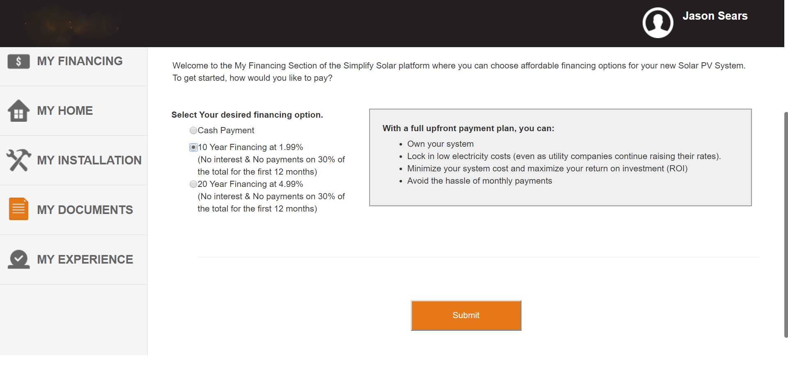
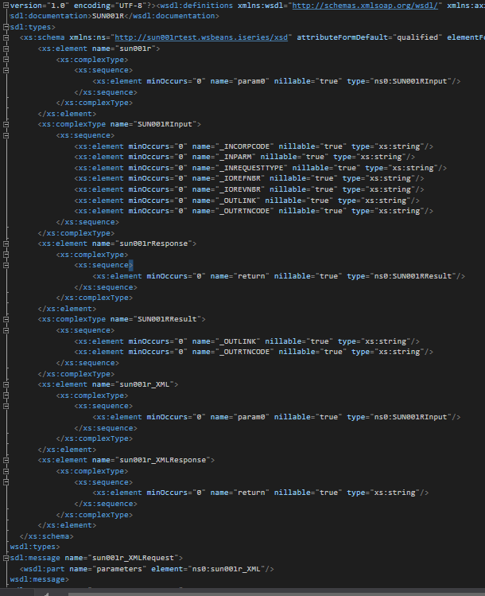
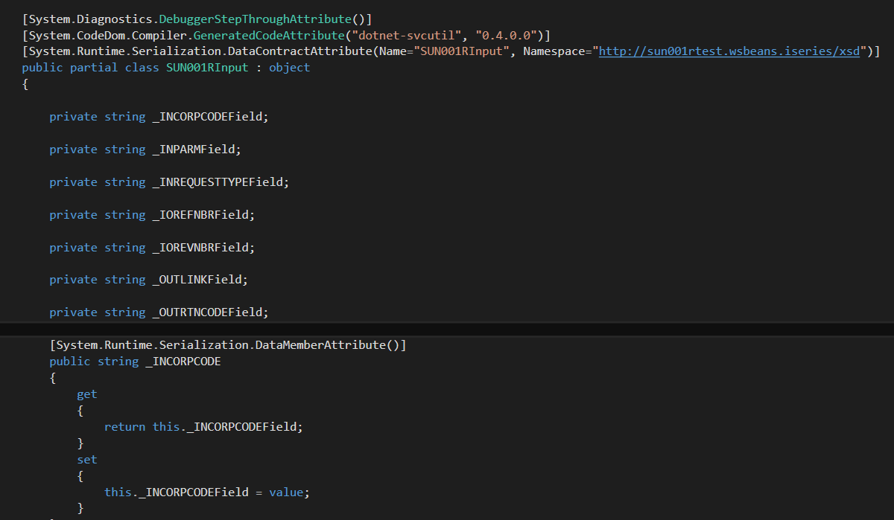
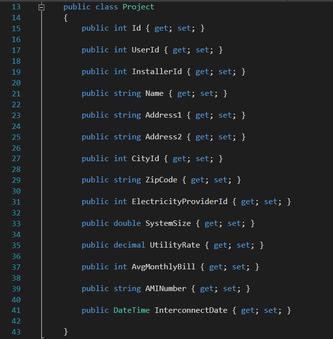
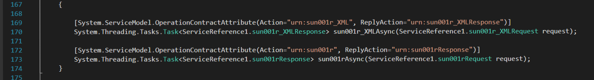
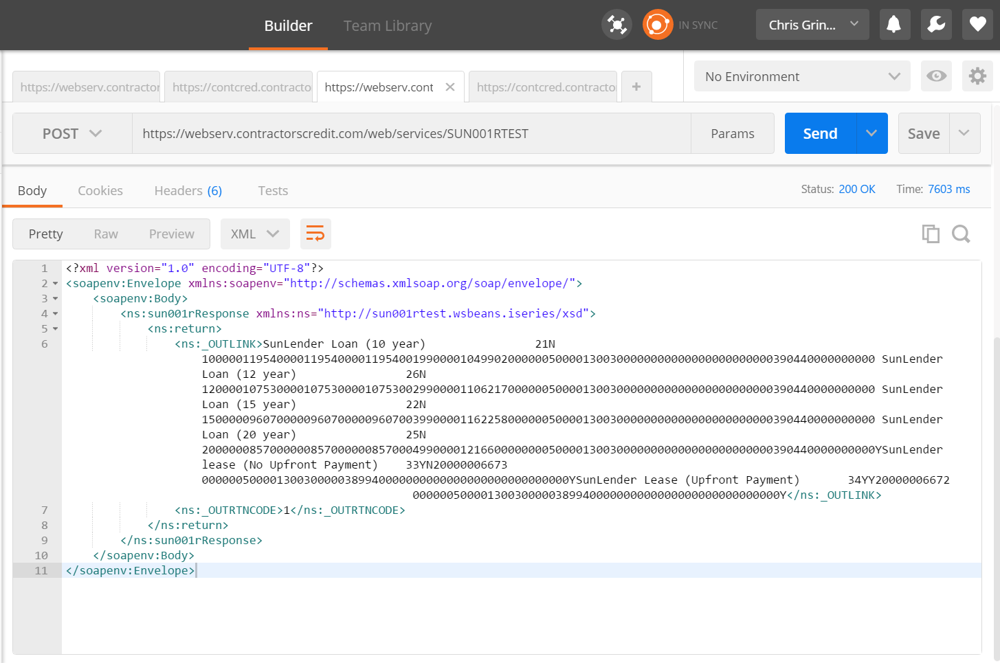
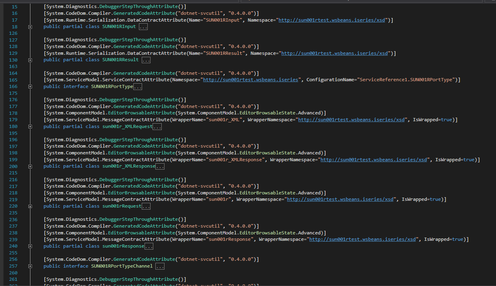
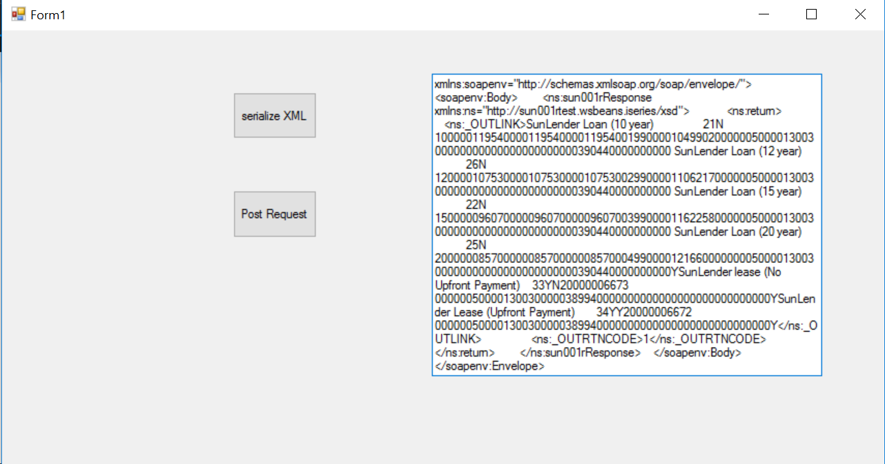

# Financing-API-and-Payment-Portal
 
###Technologies, Frameworks and Programming Languages:
ASP.NET 4.6, C#, Bootstrap, HTML, CSS, JavaScript, jQuery, SQLite, Web API, SOAP XML, WCF connected services

###Overview of Project:
Solar Payment Portal was created for a startup company here in Houston to add additional functionality to their website. The company’s vision is to create a solar energy market place where customers may select a custom solar system, find an installer, and get approved for financing with their lending partner.  With this vision in mind, Solar Payment Portal was built to handle the financing portion, allowing users to select financing options and receive an approval status and PDF documentation directly from the lender. 

###Challenges Faced and Solutions Used:
The major challenge I faced in creating this web application was working with the lending partner’s API. The API used the SOAP protocol with an XML data structure. I was provided with 2 WSDL files and Excel spreadsheets outlining the fields I would need to successfully request a response from the lender's API. Having no prior experience with SOAP XML, my first task was to learn about the structure of soap envelopes and how to interpret the WSDL file. After some research I discovered how the WSDL file explains binding the message, port, and services of the XML structure, defining the end points for each message and the communication method to be used. 

From here I needed to decide how I would handle the XML data, send it up to the API, and receive the response. My research first showed some examples of pushing the XML as a single string, manually creating the envelopes, and interpolating the data to concatenate together a very large string. However as I dug deeper, I discovered that ASP.NET WCF connected services could be used to generate a code base for both a data structure and functions for serializing the XML request. 

This was ultimately the solution which I settled on, though its implementation was not as smooth as I had hoped. This solution still required manually binding all my models to service reference models.  

It also required a little adaptation of the async methods from service reference to use in my controllers for the post request and response. 

###Error Handling and Troubleshooting:
When working with backend APIs, trouble shooting can always be a difficult task. As such there are some useful tools and techniques I was able to use to shine a light on some of the sensitive trouble areas. 

1. PostMan- PostMan is a great application for working with APIs. It allows you to simply test the structure of the information you're sending up and how you implement any security keys needed to ping the API. Postman also displays the response data providing a way of seeing the resopnse data structure prior to building an API request.  It allowed me to test the example XML structure I was given and experiment with certain data fields since changing these could give me different types of response data. 

2. WCF connected Services- Working with WCF was very helpful as I could upload the WSDL file directly into Visual Studio and have it generate a code base of models, interfaces, and methods. It also handled the model binding, although I did have to take some extra steps based on the model structure I was confined to working within. 

3. One of the most time-consuming steps of the project was actually figuring out how to use the WCF connected services and the code the it generated. To this end, I built a test application to play with the code I had generated and with the response I got back after pinging the API. To set this up, I used a basic windows form application so to display the data easily. Ultimately experimenting in this way allowed me to discover how to invoke the generated code properly. 

###MVP(Minimum Viable Product) and Stretch Goals:
###MVP
- Build a web application that allows a user to receive financing pre-approval after imputing information and choosing from the available financing options. 
- Aggregate data about the user from the database and the user selected fields to build the API request.
- Display the request response to the user. 
- Incorporate a functional dashboard design that is easy to navigate and fits with the solar company’s aesthetic.

###Stretch
- Add additional functionality for handling final approvals using a 3 step process of connecting to 2 separate APIs from the lender. 

###Contributions to be added:

- The last step of the financing process is sending back PDF documentation for the user to fill out, sign, and provide to the lender. I would like to be able to parse out the PDF and allow for input fields to be auto-filled from the database. 
- The rest of the info could be presented to the user to provide additional inputs and parsed back into a PDF when done. 
- Implementing a Docu-sign type procedure that would allow the PDF to be signed electronically and sent back up to the lender. (This would require approval by the lender)
